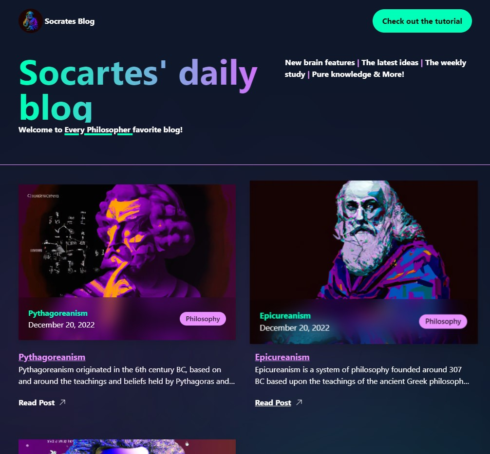
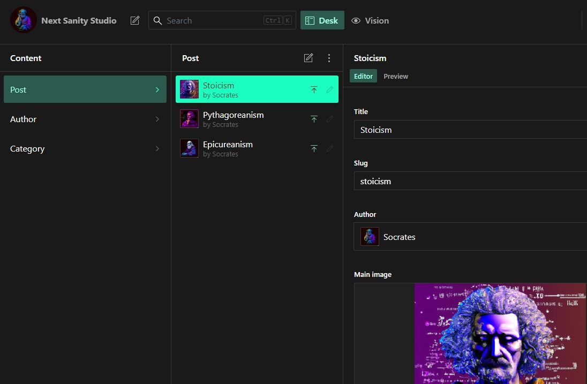
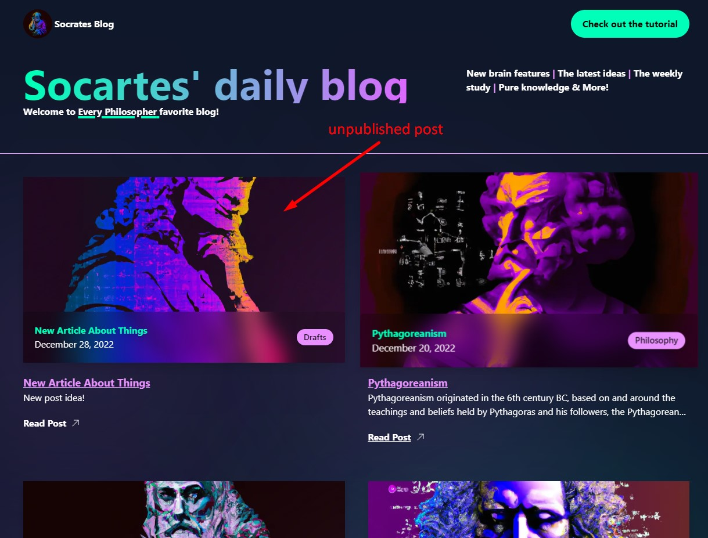
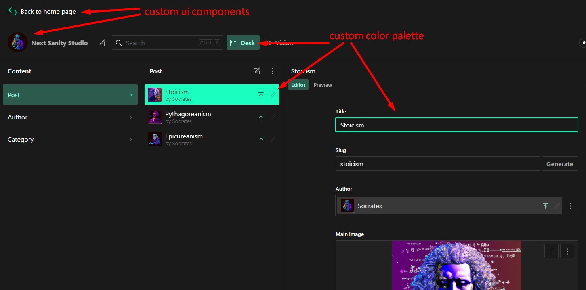
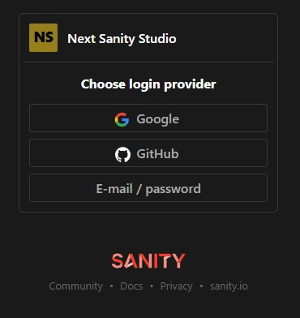

# Next.js 13 + Sanity - blog project

Let’s build a BLOG with Next.js 13 (Sanity v3, TypeScript, Tailwind CSS, Auth, CMS, Preview Mode)

#### Tutorial info

`title`: "Let’s build a BLOG with Next.js 13 (Sanity v3, TypeScript, Tailwind CSS, Auth, CMS, Preview Mode)"
`author`: Sonny Sangha \
`link`: [click](https://www.youtube.com/watch?v=x3fCEPFgUSM&ab_channel=SonnySangha) \
`progress`: finished

## Demo
[Go to demo](https://the-socrates-blog-sextus-empiricus.vercel.app) 

## Technologies & Features

- TypeScript
- Next.js 13
    - SSR
- Tailwind
- Sanity CMS
    - authentication
    - content management
    - custom CMS UI styling
    - preview mode

## Screenshots

